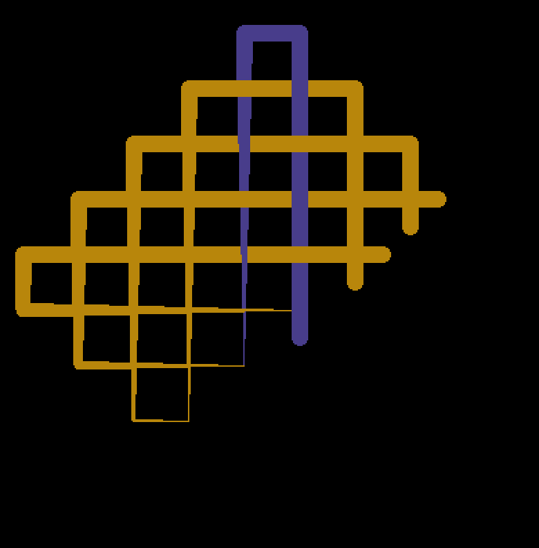

# Interleaved

Inspired by the wonderful [Knot](https://beesandbombs.tumblr.com/image/173330685124) by [Bees and Bombs](https://beesandbombs.tumblr.com/).

## Todo

* Control palette using keys
* Rotation using key
* Restructure code (everything...)

### Done
* ~~Vary speed of lines~~

## Good settings




```golang
const (
    height         = 1000.0
    width          = 1000.0
    gridSize       = 40
    nLines         = 5
    tailLength     = 5 * nLines
    lineWidth      = 12
    lineWidthDelay = 12
    tickSize       = 50
    stepSize       = 0.5
    drawGrid       = false
    drawLineBorder = false
)
```